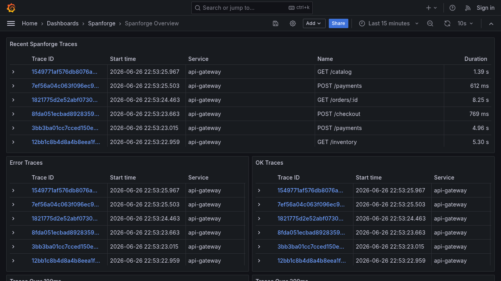

# spanforge

Use spanforge to generate realistic distributed traces without running a demo microservice system. You can test collectors, backends, dashboards and failure handling.

## Quickstart

### Test Tempo and Grafana

Run this command from a clone of the repository. It starts OpenTelemetry Collector, Tempo, Grafana and a repeating checkout brownout:

```bash
docker compose -f examples/docker-compose/tempo-grafana/docker-compose.yml up --build -d
```

Open the [Spanforge Overview dashboard](http://localhost:3000). Grafana selects this dashboard automatically.



### Preview a trace locally

Generate one repeatable `payment-system` trace tree. You do not need a collector or backend:

```bash
spanforge --profile payment-system --format pretty --output stdout --count 1 --seed 7
```

### Check traces reached Tempo

Start the Tempo and Grafana stack first. Then send 100 traces, save a run report and check the traces through Tempo:

```bash
spanforge --profile payment-system --run-id tempo-demo \
  --format otlp-http --output otlp --otlp-endpoint http://localhost:4318 \
  --count 100 --rate-unit traces --report-file /tmp/spanforge-tempo-report.json
spanforge validate tempo --endpoint http://localhost:3200 \
  --report-file /tmp/spanforge-tempo-report.json --wait 30s
```

## Installation

### Install with Go

```bash
go install github.com/robmcelhinney/spanforge/cmd/spanforge@latest
```

### Install from an archive

Download a `.tar.gz` file from [spanforge releases on GitHub](https://github.com/robmcelhinney/spanforge/releases). Copy `spanforge` into a directory listed in `PATH`.

### Run with Docker

```bash
docker run -it --rm ghcr.io/robmcelhinney/spanforge:latest --help
```

### Build from source

```bash
make build
./bin/spanforge --version
```

## Supported formats

Spanforge supports these trace formats:

- OTLP HTTP with protobuf
- OTLP gRPC
- Zipkin v2 JSON
- JSONL
- pretty tree

## Supported outputs

Spanforge can send traces to:

- standard output
- a file
- an OTLP endpoint
- a Zipkin endpoint
- the noop output for benchmarks

## Common workflows

```bash
# Preview shallow API gateway traffic
spanforge --profile api-gateway --format pretty --output stdout --count 1 --seed 7

# Send OTLP HTTP traces to a collector for two minutes
spanforge --format otlp-http --output otlp --otlp-endpoint http://localhost:4318 \
  --rate 100 --rate-unit traces --duration 2m

# Send Zipkin v2 JSON to Zipkin
spanforge --format zipkin-json --output zipkin \
  --zipkin-endpoint http://localhost:9411 --duration 30s

# Test a backend with awkward but valid telemetry
spanforge --profile api-gateway --weird future-timestamp,high-cardinality-route \
  --format otlp-http --output otlp --otlp-endpoint http://localhost:4318

# Generate intentionally invalid payloads for rejection testing
spanforge --profile web --invalid duplicate-span-id,negative-duration \
  --format zipkin-json --output zipkin --zipkin-endpoint http://localhost:9411
```

## Use realistic profiles

List the available profiles or inspect `payment-system`:

```bash
spanforge profiles list
spanforge profiles show payment-system
```

`payment-system` generates checkout and refund traces. It uses these services:

- `edge-gateway`
- `checkout-api`
- `cart-service`
- `pricing-service`
- `fraud-service`
- `payment-service`
- `ledger-service`
- `email-service`


The trace tree looks like this:

```text
POST /checkout
  handle checkout
  load cart
  calculate pricing
  score fraud risk
  authorize payment
  write ledger entry
  send receipt
```

`api-gateway` generates shallow, high-volume gateway traces. They include authentication checks, rate limits, upstream API calls, route tiers and HTTP statuses.


## Set environment variables

You can set options with `SPANFORGE_*` environment variables.

Spanforge applies settings in this order:

1. Command-line flags override all other settings.
2. Environment variables override YAML settings and built-in defaults.
3. YAML settings from `--config` override built-in defaults.
4. Built-in defaults apply when you do not set an option.

For example:

- `SPANFORGE_FORMAT=otlp-http`
- `SPANFORGE_OUTPUT=otlp`
- `SPANFORGE_OTLP_ENDPOINT=http://localhost:4318`
- `SPANFORGE_HEADERS=authorization=Bearer token,x-tenant=demo`
- `SPANFORGE_DEBUG=true`

## CLI reference

Run `spanforge --help` to see all options. Maintainers can run `make docs` to update this generated reference.

<!-- BEGIN AUTO-GENERATED FLAGS -->
```console
Flags:
      --batch-size int                Spans per batch (default 512)
      --cache-hit-rate string         Cache hit ratio (default "85%")
      --compress string               Compression for OTLP HTTP (gzip)
      --config string                 Path to YAML config file
      --count int                     Total span/trace count (overrides duration if > 0)
      --db-heavy string               DB-intensive operation ratio (default "20%")
      --debug                         Enable debug logs for trace emission and sink sends
      --depth int                     Max trace depth (default 4)
      --duration duration             Run duration (set to 0s for no time limit) (default 30s)
      --errors string                 Error rate percentage (default "0.5%")
      --fanout float                  Average span fanout (default 2)
      --file string                   Output file path
      --flush-interval duration       Sink flush interval (default 200ms)
      --format string                 Output format (default "jsonl")
      --headers strings               Additional headers (repeat k=v)
  -h, --help                          help for spanforge
      --high-cardinality              Enable high-cardinality attributes (request IDs, message IDs)
      --http-listen string            Admin HTTP listen address for /healthz and /stats (default "127.0.0.1:8080")
      --invalid strings               Intentionally invalid telemetry modes (repeat or comma-separate)
      --load string                   Built-in load preset
      --otlp-endpoint string          OTLP endpoint
      --otlp-insecure                 Use insecure OTLP gRPC transport (default true)
      --output string                 Output sink (default "stdout")
      --p50 duration                  p50 span latency (default 30ms)
      --p95 duration                  p95 span latency (default 120ms)
      --p99 duration                  p99 span latency (default 350ms)
      --phase-file string             Path to load phase YAML file
      --profile string                Generation profile (default "web")
      --rate float                    Generation rate amount (default 200)
      --rate-interval duration        Time interval for rate amount (default 1s)
      --rate-unit string              Rate unit: spans or traces (default "spans")
      --report-file string            Write run summary as JSON to this path
      --retries string                Retry rate percentage (default "1%")
      --routes int                    Number of named routes/methods per profile (default 8)
      --run-id string                 Stable run identifier for generated telemetry
      --seed int                      Random seed (default 1)
      --service-prefix string         Service name prefix (default "svc-")
      --services int                  Number of services (default 8)
      --sink-max-in-flight int        Maximum concurrent in-flight sink requests (default 2)
      --sink-retries int              Retry attempts for sink requests (default 2)
      --sink-retry-backoff duration   Backoff between sink retries (default 300ms)
      --sink-timeout duration         Per-request sink timeout (default 10s)
      --variety string                Variety level: low, medium, high (default "medium")
      --version                       Print version and exit
      --weird strings                 Valid but awkward telemetry modes (repeat or comma-separate)
      --workers int                   Concurrent generator workers (default 1)
      --zipkin-endpoint string        Zipkin endpoint

Use "spanforge [command] --help" for more information about a command.
```
<!-- END AUTO-GENERATED FLAGS -->

## Use Docker Compose examples

Use one of these examples:

- [Tempo stack](examples/docker-compose/tempo/docker-compose.yml)
- [Tempo and Grafana dashboard](examples/docker-compose/tempo-grafana/docker-compose.yml)
- [Jaeger stack](examples/docker-compose/jaeger/docker-compose.yml)

## Development

Run the project checks from the repository root:

```bash
make build
make test
make lint
make bench-transport
```

## Read more about spanforge

Use these documents for more detail:

- [runbooks, presets and release notes](docs/further-info.md)
- [backend compatibility](docs/compatibility.md)
- [report and validation JSON schemas](docs/schemas.md)

Use these documents to track plans and progress:

- [product roadmap](ROADMAP.md)
- [implementation checklist](spanforge_action_checklist.md)

## Acknowledgements

[flog](https://github.com/mingrammer/flog) inspired spanforge.

## License

[MIT](LICENSE)
