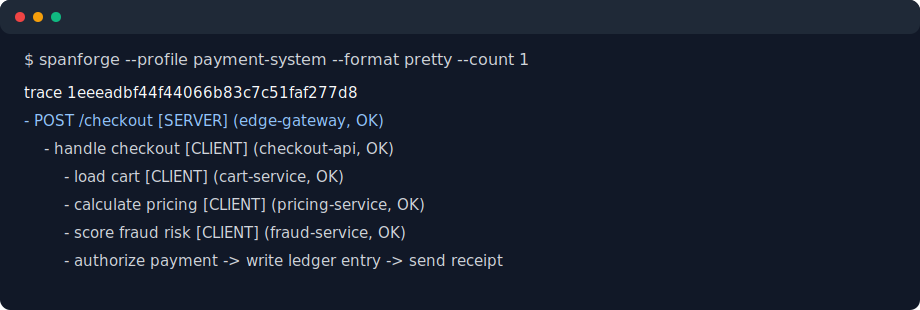
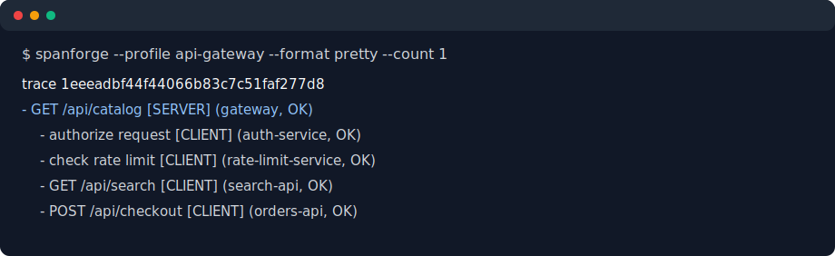

# spanforge

spanforge is a fake distributed tracing generator for common trace formats such as OTLP (HTTP/gRPC), Zipkin v2 JSON, JSONL, and pretty tree output.

It is useful for testing telemetry pipelines and backends like OpenTelemetry Collector, Tempo, Jaeger, and Zipkin.

> Thanks to [flog](https://github.com/mingrammer/flog) for inspiration.

## Installation

### Using go install

```bash
go install github.com/robmcelhinney/spanforge/cmd/spanforge@latest
```

### Using .tar.gz archive

Download an archive from [GitHub Releases](https://github.com/robmcelhinney/spanforge/releases), then copy `spanforge` to your system path.

### Using docker

```bash
docker run -it --rm ghcr.io/robmcelhinney/spanforge:latest --help
```

### Build from source

```bash
make build
./bin/spanforge --version
```

## Supported Formats

- OTLP HTTP (protobuf)
- OTLP gRPC
- Zipkin v2 JSON
- JSONL
- Pretty tree

## Supported Outputs

- Stdout
- File
- OTLP endpoint
- Zipkin endpoint
- Noop (benchmark mode)

## Usage

To see the options (`spanforge --help`)

Run `make docs` to refresh this block.

<!-- BEGIN AUTO-GENERATED FLAGS -->
```console
Flags:
      --batch-size int                Spans per batch (default 512)
      --cache-hit-rate string         Cache hit ratio (default "85%")
      --compress string               Compression for OTLP HTTP (gzip)
      --config string                 Path to YAML config file
      --count int                     Total span/trace count (overrides duration if > 0)
      --db-heavy string               DB-intensive operation ratio (default "20%")
      --debug                         Enable debug logs for trace emission and sink sends
      --depth int                     Max trace depth (default 4)
      --duration duration             Run duration (set to 0s for no time limit) (default 30s)
      --errors string                 Error rate percentage (default "0.5%")
      --fanout float                  Average span fanout (default 2)
      --file string                   Output file path
      --flush-interval duration       Sink flush interval (default 200ms)
      --format string                 Output format (default "jsonl")
      --headers strings               Additional headers (repeat k=v)
  -h, --help                          help for spanforge
      --high-cardinality              Enable high-cardinality attributes (request IDs, message IDs)
      --http-listen string            Admin HTTP listen address for /healthz and /stats (default "127.0.0.1:8080")
      --load string                   Built-in load preset
      --otlp-endpoint string          OTLP endpoint
      --otlp-insecure                 Use insecure OTLP gRPC transport (default true)
      --output string                 Output sink (default "stdout")
      --p50 duration                  p50 span latency (default 30ms)
      --p95 duration                  p95 span latency (default 120ms)
      --p99 duration                  p99 span latency (default 350ms)
      --phase-file string             Path to load phase YAML file
      --profile string                Generation profile (default "web")
      --rate float                    Generation rate amount (default 200)
      --rate-interval duration        Time interval for rate amount (default 1s)
      --rate-unit string              Rate unit: spans or traces (default "spans")
      --report-file string            Write run summary as JSON to this path
      --retries string                Retry rate percentage (default "1%")
      --routes int                    Number of named routes/methods per profile (default 8)
      --run-id string                 Stable run identifier for generated telemetry
      --seed int                      Random seed (default 1)
      --service-prefix string         Service name prefix (default "svc-")
      --services int                  Number of services (default 8)
      --sink-max-in-flight int        Maximum concurrent in-flight sink requests (default 2)
      --sink-retries int              Retry attempts for sink requests (default 2)
      --sink-retry-backoff duration   Backoff between sink retries (default 300ms)
      --sink-timeout duration         Per-request sink timeout (default 10s)
      --variety string                Variety level: low, medium, high (default "medium")
      --version                       Print version and exit
      --workers int                   Concurrent generator workers (default 1)
      --zipkin-endpoint string        Zipkin endpoint

Use "spanforge [command] --help" for more information about a command.
```
<!-- END AUTO-GENERATED FLAGS -->

```console
# Generate traces to stdout (JSONL)
$ spanforge

# Preview a realistic checkout trace tree
$ spanforge --profile payment-system --format pretty --output stdout --count 1 --seed 7

# Preview shallow API gateway traffic
$ spanforge --profile api-gateway --format pretty --output stdout --count 1 --seed 7

# Send OTLP HTTP traces to collector for 2 minutes
$ spanforge --format otlp-http --output otlp --otlp-endpoint http://localhost:4318 --rate 100 --rate-unit traces --duration 2m

# Send Zipkin JSON spans to Zipkin API
$ spanforge --format zipkin-json --output zipkin --zipkin-endpoint http://localhost:9411 --duration 30s

# Run benchmark mode with sink disabled and write JSON report
$ spanforge --output noop --format otlp-http --duration 30s --report-file ./out/report.json

# Send OTLP HTTP traces, write a report, then validate sampled traces in Tempo
$ spanforge --format otlp-http --output otlp --otlp-endpoint http://localhost:4318 --duration 30s --report-file ./out/tempo-report.json
$ spanforge validate tempo --endpoint http://localhost:3200 --report-file ./out/tempo-report.json

# Validate sampled traces in Jaeger after a Jaeger/OTLP run that wrote ./out/jaeger-report.json
$ spanforge validate jaeger --endpoint http://localhost:16686 --report-file ./out/jaeger-report.json --output json

# Run continuously (no duration deadline)
$ spanforge --format otlp-http --output otlp --otlp-endpoint http://localhost:4318 --duration 0s

# Run with debug logs (written to stderr)
$ spanforge --format otlp-http --output otlp --otlp-endpoint http://localhost:4318 --debug

# Load from YAML config, override one value via CLI
$ SPANFORGE_OUTPUT=otlp spanforge --config examples/config/spanforge.yaml --rate 300
```

## Realistic Profiles

List available profiles:

```bash
spanforge profiles list
spanforge profiles show payment-system
```

`payment-system` generates recognizable checkout/refund traces across `edge-gateway`, `checkout-api`, `cart-service`, `pricing-service`, `fraud-service`, `payment-service`, `ledger-service`, and `email-service`.



Example preview:

```text
POST /checkout
  handle checkout
  load cart
  calculate pricing
  score fraud risk
  authorize payment
  write ledger entry
  send receipt
```

`api-gateway` generates shallow high-volume gateway traces with auth checks, rate-limit decisions, upstream API calls, route tiers, and HTTP status distribution.



## Environment Variables

`SPANFORGE_*` env vars are supported.

Precedence:

1. CLI flags
2. Environment variables
3. YAML config (`--config`)
4. Built-in defaults

Examples:

- `SPANFORGE_FORMAT=otlp-http`
- `SPANFORGE_OUTPUT=otlp`
- `SPANFORGE_OTLP_ENDPOINT=http://localhost:4318`
- `SPANFORGE_HEADERS=authorization=Bearer token,x-tenant=demo`
- `SPANFORGE_DEBUG=true`

## Docker Compose Examples

- Tempo stack: `examples/docker-compose/tempo/docker-compose.yml`
- Tempo/Grafana dashboard demo: `examples/docker-compose/tempo-grafana/docker-compose.yml`
- Jaeger stack: `examples/docker-compose/jaeger/docker-compose.yml`

## Development

```bash
make build
make test
make lint
make bench-transport
```

## Further Reading

Detailed runbooks, presets, and release/CI notes are in `docs/further-info.md`.

Planning docs:

- `ROADMAP.md` tracks the current product roadmap.
- `spanforge_action_checklist.md` tracks implementation status and next actions.
- `spanforge_plan.md` is the original MVP blueprint.

## License

[MIT](LICENSE)
